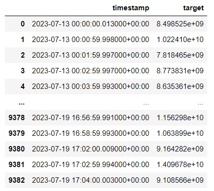
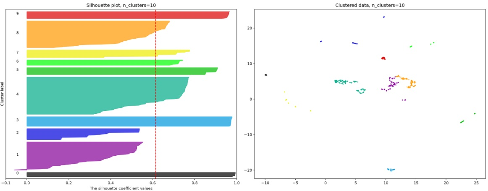
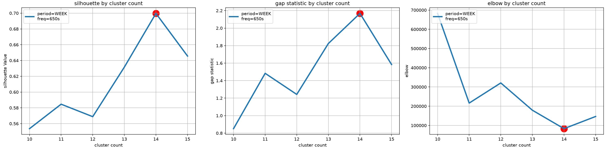
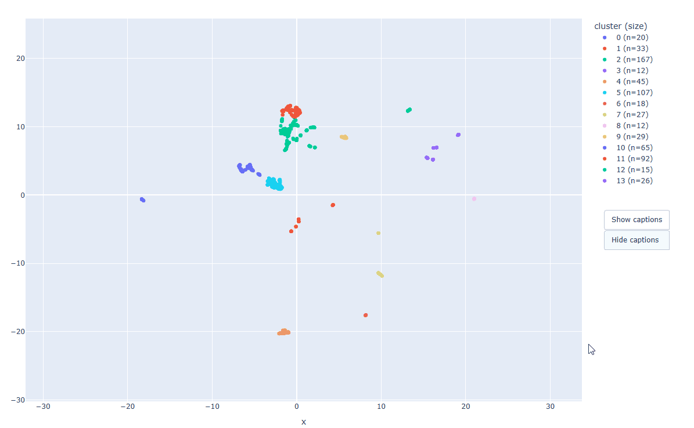

# Time series clustering

[](https://colab.research.google.com/drive/1a8AHaMQq95fzotLvxKV9JsX2UseTcJwn?usp=sharing)

Clustering of time series reflecting hardware device parameter values.<br><br>
Clustering is performed using several algorithms: [N2D](./clustering/README.md#n2d), [IDEC](./clustering/README.md#idec), and [k-Shape](./clustering/README.md#k-shape)<br>

Clustering quality is evaluated using the following [metrics](./utils/README.md):
- silhouette score
- Calinski-Harabasz Index
- Davies-Bouldin Index<br>

The optimal number of clusters is determined using:
- silhouette score
- elbow method
- gap statistic


## Preparing
Clone repo 
```bash
git clone https://github.com/ilyagvozdarev/timeseries-clustering.git
cd timeseries-clustering
```
  
Create venv  
```bash
python -m venv venv
source venv/bin/activate
```
  
Install requirements
```bash
pip install -r requirements.txt
```

## Run

```bash
python ts_clustering.py \
--tss_path "data/tss.h5" \
--method n2d \
--method_config "model_configs/n2d_config.yml" \
--min_clusters 10 \
--max_clusters 15 \
--periods DAY WEEK \
--freqs 60 650 \
--optim_freq \
--threshold 0.001
```

output structure:
```
|- metrics
   |- best_metrics__n2d__DAY__60s__10_12_clusters.txt
   |- best_metrics__n2d__WEEK__60s__10_12_clusters.txt
   |- clusters_count_metrics__n2d.csv
   |- metrics__n2d.csv
   |- metrics__n2d__DAY__60s__10_12_clusters.csv
   |- metrics__n2d__WEEK__60s__10_12_clusters.csv
|- plots
   |- clusters
      |- clusters__n2d__DAY__60s__10_clusters.jpg
      |- clusters__n2d__DAY__60s__11_clusters.jpg
      |- clusters__n2d__DAY__60s__12_clusters.jpg
      |- clusters__n2d__WEEK__60s__10_clusters.jpg
      ...
   |- clusters_scatter
      |- cluster__n2d__DAY__60s__10_clusters.html
      |- cluster__n2d__DAY__60s__11_clusters.html
      |- cluster__n2d__DAY__60s__12_clusters.html
      ...
   |- metrics__n2d.png
   |- silhouettes__n2d__DAY__60s.png
   |- silhouettes__n2d__WEEK__60s.png
```

## Data

Series naming format - monitoringMetric$*identifier*_*period*<br><br>
Possible values for the period over which values are stored in the time series: DAY, WEEK, MONTH, HALF_YEAR, INFINITE.

Example:<br>
series "monitoringMetric$20221722__WEEK":

<p align="center">

</p>

## Preprocessing of series

- removal of empty series
- for each period, keep the series (across all periods) that overlap with the interval [median start time across all series of the period + 10 min, median end time across all series of the period - 10 min]
- resampling at the optimal frequency:<br>
the optimal frequency for a period is the most common optimal frequency among the series falling into that period
- interpolation of NaN values produced after resampling
- truncation to the interval boundaries (see item 2)
- removal of empty series that may have reappeared after truncation
- removal of constant series
- min-max scaling

<br>
Algorithm for computing the optimal frequency:

1. Resample the input series at a frequency equal to the median frequency
2. Build a grid of frequencies from the median frequency to the maximum possible frequency (1 day), with a specified number of elements in the grid
3. Use binary search over the grid to find the largest downsampling frequency — the frequency at which the resampled series (downsampling + upsampling back to the original median frequency) has the largest error that is still below a specified threshold
<br>Error - MSE(original series, resampled series) / MSE(original series, baseline series), baseline downsampling frequency = 86400 sec (1 day)

The purpose is maximum data compression (without quality loss below the specified threshold) to speed up further clustering.
<br><br>


## Clustering Evaluation and Visualization

- [Silhouette Score Plot](#silhouette-score-plot-and-cluster-visualization-in-2d-space)
- [Clustering Quality Metrics Plots](#clustering-quality-metrics-plots)
- [Cluster Visualization in 2D Space](#cluster-visualization-in-2d-space)
- [Series Plots Grouped by Cluster](#series-plots-grouped-by-cluster)<br>

#### Silhouette Score Plot and Cluster Visualization in 2D Space

left plot: for each cluster, silhouette coefficient values for all points in the cluster; points are arranged along the vertical axis, the right edge of each bar shows the silhouette coefficient value for that point. The dashed line shows the mean silhouette coefficient across all points.<br>
right plot: points in 2D space colored according to their cluster.<br>
dashed line: is the mean silhouette coefficient value (over all points)<br>

<p align="center">

</p>


#### Clustering Quality Metrics Plots
Plots of clustering quality metric values (silhouette score, Calinski-Harabasz score, Davies-Bouldin score) as a function of the number of clusters for a given frequency:
<br><br>
<p align="center">

</p>


#### Cluster Visualization in 2D Space
Visualization of clusters in 2D space for a specific frequency and clustering:
<br>
<p align="center">

</p>


#### Series Plots Grouped by Cluster
Plots of series grouped by cluster (columns), for a given clustering (number of clusters), model, frequency, and period:
<br>
<p align="center">

</p>
