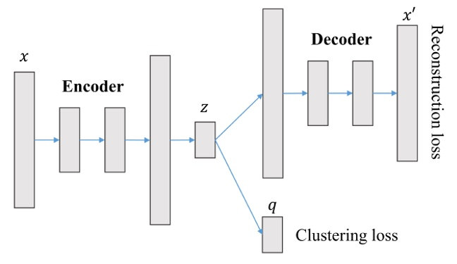

## Clustering methods

### N2D
[https://arxiv.org/abs/1908.05968](https://arxiv.org/abs/1908.05968) 
[https://github.com/rymc/n2d](https://github.com/rymc/n2d)
- Train an **autoencoder** (reconstruction) that takes input series with latent_dim equal to the number of clusters, obtaining initial series embeddings.  Loss function - MSE
- Fine-tune the resulting embeddings by searching for more clusterable embeddings using the **UMAP** method - a manifold learning method that preserves local distances.
 UMAP is an algorithm similar to t-SNE, but with a stronger mathematical foundation.
- On the resulting more clusterable embeddings, we apply a final simple clustering algorithm (e.g. **GMM (GaussianMixture)**) to detect the clusters. 
 
 
### IDEC
[https://www.ijcai.org/proceedings/2017/0243.pdf](https://www.ijcai.org/proceedings/2017/0243.pdf) 
[https://github.com/XifengGuo/IDEC](https://github.com/XifengGuo/IDEC)

- Train an **autoencoder** (reconstruction) that takes input series with latent_dim equal to the number of clusters, obtaining initial series embeddings.  Loss function - MSE
- Simultaneously, a **clustering layer** is attached to the output of the autoencoder's encoder, which determines the similarity of the embedding to each cluster center.

 $q_{ij}$ is computed - the similarity between the embedding of point $z_{i}$ and cluster center $\mu_{j}$, calculated using the Student's t-distribution (as in the t-SNE algorithm).  The resulting value can be interpreted as the probability of cluster j for point i:
 
$$q_{ij} = \frac{(1 + \|z_i - \mu_j\|^2)^{-1}}{\sum_j (1 + \|z_i - \mu_j\|^2)^{-1}}$$
 $p_{ij}$ is computed - the target distribution, built from the same $q_{ij}$:
$$p_{ij} = \frac{q_{ij}^2 / \sum_i q_{ij}}{\sum_j \left( q_{ij}^2 / \sum_i q_{ij} \right)}$$

- squaring — sharpens the distribution: points that already have high confidence in a cluster get an even higher target probability 
- dividing by ∑qij — prevents large clusters from dominating the loss and helps avoid a degenerate solution where all points are assigned to single cluster

Cluster centers are updated by optimizing the loss function - Kullback-Leibler (KL) divergence.  At the first step, the centers can be initialized with any algorithm (e.g. k-means):

$$L = KL(P \| Q) = \sum_i \sum_j p_{ij} \log \frac{p_{ij}}{q_{ij}}$$

gradients $\frac{\partial L}{\partial z_{i}}$ update the autoencoder (point embeddings) and $\frac{\partial L}{\partial \mu_{j}}$ update the cluster centers $\mu_{j}$.

  cluster of object $i = argmax_j(q_{ij})$
 
 overall loss function:

$$L = L_r + \gamma L_c$$

$L_{r}$ - autoencoder loss (MSE)
 $L_{c}$ - clustering loss (KL)
 $\gamma > 0$ - coefficient controlling the degree of embedding distortion. The larger the value, the more clusterable but less reliable the point embeddings become (they represent the original series worse)
  

### k-Shape
[k-Shape: Efficient and Accurate Clustering of Time Series](https://sigmodrecord.org/publications/sigmodRecord/1603/pdfs/18_kShape_RH_Paparrizos.pdf) 
[https://tslearn.readthedocs.io/en/latest/gen_modules/clustering/tslearn.clustering.KShape.html](https://tslearn.readthedocs.io/en/latest/gen_modules/clustering/tslearn.clustering.KShape.html)  
k-Shape is based on an iterative refinement procedure similar to the one used in the k-means algorithm, but with significant differences. In particular, k-Shape uses a different distance measure and a different method for computing the centroid (cluster center). The k-Shape distance measure attempts to preserve the shapes of time series when comparing them. To do this, k-Shape uses a distance measure that is invariant to scaling (changing all values and time intervals by the same factor does not affect the distance measure) and to shifting (changing the offset of one series relative to another does not affect the distance measure) - Shape-based distance (SBD).
 **Shape-based distance (SBD)** - a measure that decreases as the maximum (over all shifts of one series relative to another) cross-correlation value of the series, normalized by the series' autocorrelations, increases:

$$SBD(\vec{x}, \vec{y}) = 1 - \max_w \left( \frac{CC_w(\vec{x}, \vec{y})}{\sqrt{R_0(\vec{x}, \vec{x}) \cdot R_0(\vec{y}, \vec{y})}} \right)$$

 
In k-means, the centroid (cluster center) is computed as the mean of the points.
 
In k-Shape, computing the centroid is an optimization task whose goal is to find a point such that the sum of squared distances (using the SBD measure) to all other points (time series) is maximized:

$$\vec{\mu_k}^{\star} = \operatorname*{argmax}_{\vec{\mu_k}} \sum_{\vec{x_i} \in P_k} NCC_c(\vec{x_i}, \vec{\mu_k})^2$$

$$= \operatorname*{argmax}_{\vec{\mu_k}} \sum_{\vec{x_i} \in P_k} \left( \frac{\max_w CC_w(\vec{x_i}, \vec{\mu_k})}{\sqrt{R_0(\vec{x_i}, \vec{x_i}) \cdot R_0(\vec{\mu_k}, \vec{\mu_k})}} \right)^2$$

At each iteration, k-Shape performs two steps:
- during the assignment step, the algorithm updates the cluster assignment for each series by comparing it to all computed centroids and assigning it to the cluster of the nearest centroid, using the SBD distance measure to determine cluster assignment
- during the refinement step, the cluster centroids are updated to reflect the changes in cluster composition from the previous step.

The algorithm repeats these two steps until either no changes occur in cluster composition, or the maximum allowed number of iterations is reached.
  
#
